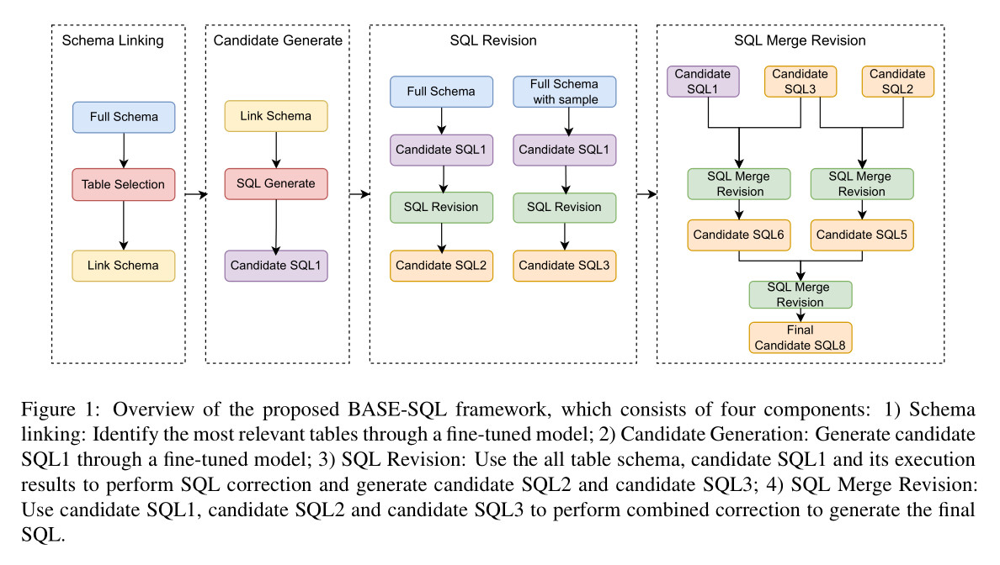
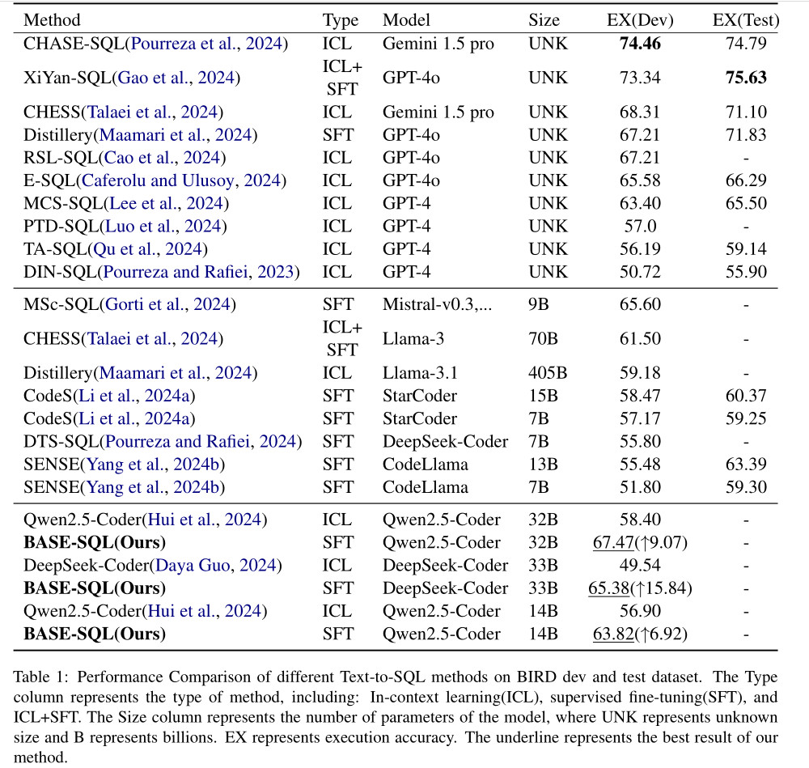
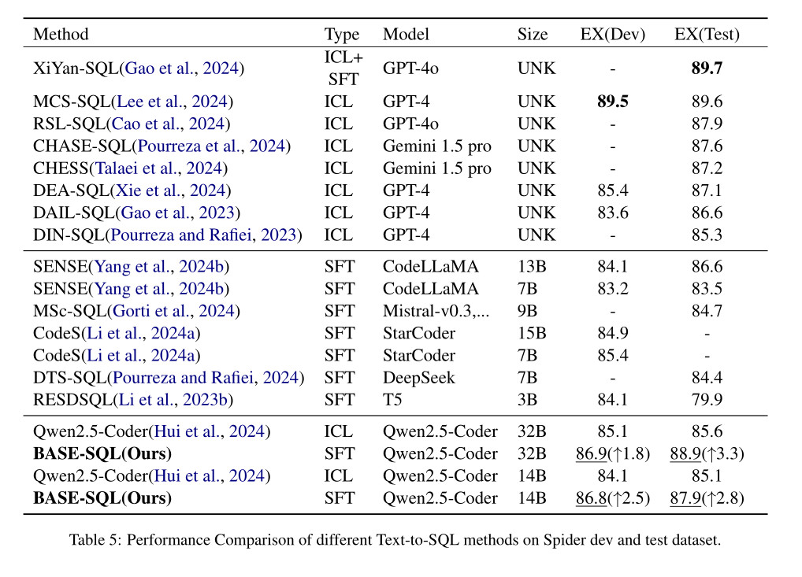
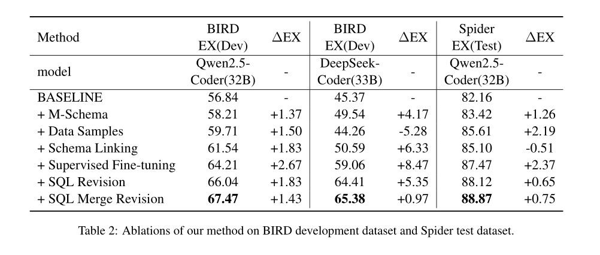

# BASE-SQL: A powerful open source Text-To-SQL baseline approach

## Todo:
- [ ] Organize the code and publish it to github.
- [ ] Release model.
- [ ] ...

## News


## Introduction

The conversion of natural language into SQL language for querying databases (Text-to-SQL) 
has broad application prospects and has attracted widespread attention. At present, 
the mainstream Text-to-SQL methods are mainly divided into in-context learning (ICL) based methods 
and supervised fine-tuning (SFT) based methods. ICL-based methods can achieve relatively good results 
thanks to the use of the most advanced closed-source models. However, in real-world application scenarios,
factors such as data privacy, SQL generation efficiency and cost need to be considered. 
SFT-based methods have certain advantages. At present, methods based on fine-tuning of open source models 
lack easy-to-implement and effective (cost-effective) baseline methods. We propose a pipeline-based 
method using open source model fine-tuning, referred to as BASE-SQL, which includes four components: 
Schema Linking, Candidate SQL Generate, SQL Revision and SQL Merge Revision. 
Experimental results show that BASE-SQL uses the open source model Qwen2.5-Coder-32B-Instruct,
and achieves an accuracy of 67.47% on the BIRD development set and 88.9% on the Spider test set, 
which is significantly better than other methods using open source models, 
and even exceeds several methods using the GPT-4o closed-source model. 
At the same time, BASE-SQL is easy to implement and highly 
efficient (on average, only five calls to the large language model are required to generate SQL once). 
The code will be open sourced at github.

## Methodology



## Main Results

### Bird result




### Spider result



### Ablation Studies




## Citation
If you find our work helpful, feel free to give us a cite.
```bibtex
@misc{sheng2025basesqlpowerfulopensource,
      title={BASE-SQL: A powerful open source Text-To-SQL baseline approach}, 
      author={Lei Sheng and Shuai-Shuai Xu and Wei Xie},
      year={2025},
      eprint={2502.10739},
      archivePrefix={arXiv},
      primaryClass={cs.CL},
      url={https://arxiv.org/abs/2502.10739}, 
}
```
